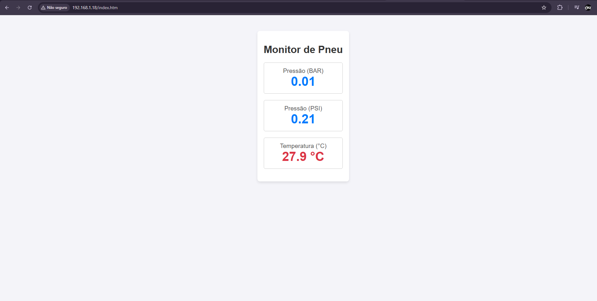
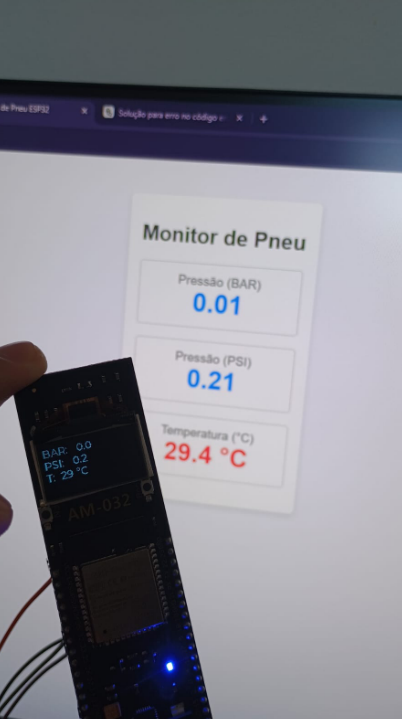
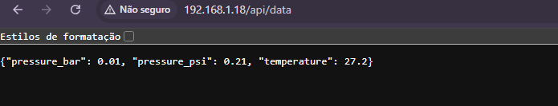
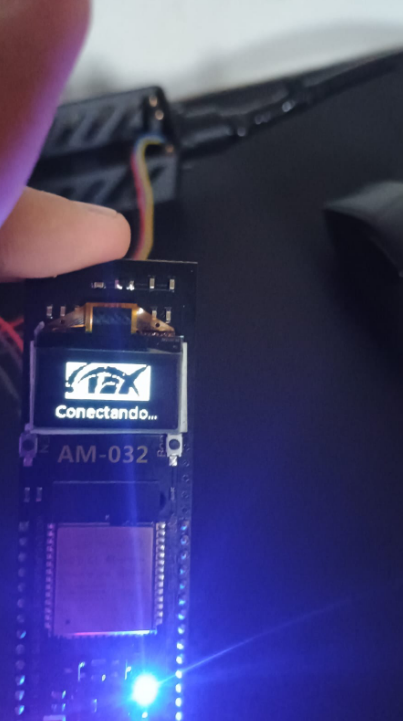
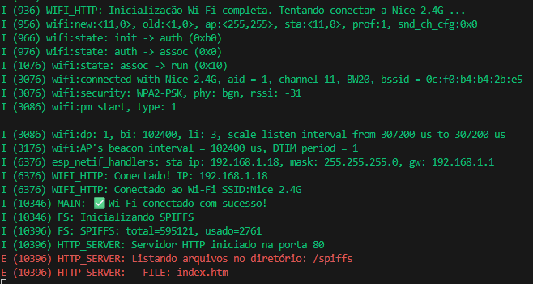

 MODIFICANDO

## Pré-requisitos:
### Software
- Visual Studio Code
- ESP-IDF 5.3.0 (instalado e configurado)
- Python 3.9+
- Ambiente de desenvolvimento **https://www.youtube.com/watch?v=1u9h4_O1yQg**

## Sensor SMP3011  

O prototipo do projeto está quase no final, agora ele está conseguindo integrar com o site a partir do http e o spiffs que é responsavel por amarmazear os arquivos, 
dentro do http_server.cpp ele pega os valores gerados pelo o sensor e já integra no site.

e com /api/data, conseguimos ver o valor de json gerado:

Implementação da logo no momento em que está conectando o wifi:

Conexão Wifi, HTTP e Spiffs:

